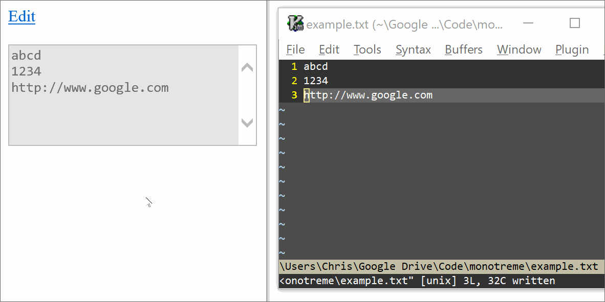

# Monotreme

Monotreme helps you see and edit data in files via your browser. You choose the file's location (local drive filepath or web server URL).

Local save currently uses Internet Explorer 11's ActiveX controls. Yikes! 
Remote save uses WebDAV. Have fun configuring your server!

## Usage

Monotreme is an object prototype. It provides methods for:

- reading data from a user-specified file into a JavaScript equivalent (currently .txt into a JS string; maybe .json arrays and objects)
- visualising and editing the JS data via form elements
- saving JS data to a user-specified file.

See example.html.